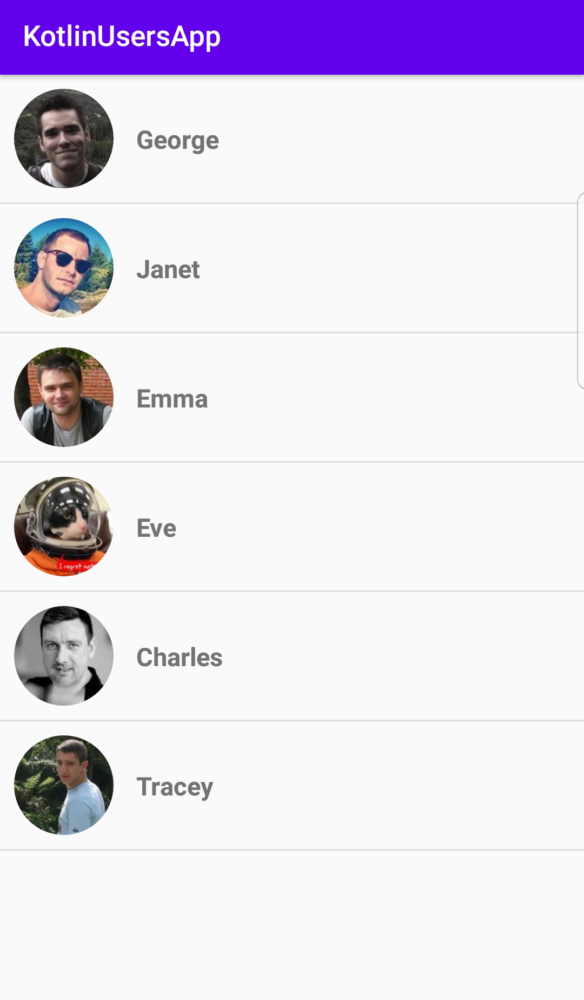

# UsersApp with Kotlin
is a simple application that gets fake users from an api

# Used Technologies
- Kotlin
- Corrutinas
- ViewModel
- ViewModel KTX
- LiveData
- Fragment KTX
- Glide
- Retrofit
- Gson
- Circle Image
- Dagger 2

# Links and Resources used in this project
- [Dependency Injection](https://developer.android.com/training/dependency-injection)
- [ViewModel](https://developer.android.com/topic/libraries/architecture/viewmodel?gclid=CjwKCAjw1K75BRAEEiwAd41h1LoTioM8nkc1UQX5ISNi_TtEZKNjRkxhx1KfzAlBQvkLX56qvyvOXBoCdQMQAvD_BwE&gclsrc=aw.ds)
- [LiveData](https://developer.android.com/topic/libraries/architecture/livedata)
- [KTX](https://developer.android.com/kotlin/ktx)
- [Retrofit](https://square.github.io/retrofit/)
- [Circle Image](https://github.com/hdodenhof/CircleImageView)
